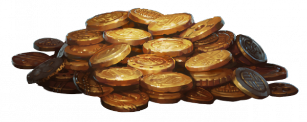
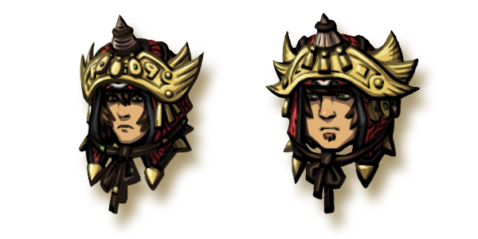

# Announcing the MINECON Open

Posted on June 5 2015 by Gary

We’re happy to announce an official Scrolls tournament for this year’s MINECON. Read on for more details!

# The MINECON Open
The MINECON Open will consist of two qualifying tournaments in the month of June, with the finals taking place during MINECON weekend in early July. All players are eligible to participate and are not required to attend the convention.

## REGISTRATION IS NOW CLOSED
Participants must check in the day of the tournament between 15:00-15:45 GMT in the in-game channel “Minecon.” Any questions can be directed to Atmaz in game, or by email at atmaz@scrolls.com. You must register before 22:00 GMT the day before each qualifier, at which time ranked ratings will be recorded for bracket seeding purposes.

Once again, players are **not required to attend MINECON**.

# Tournament Format
## Qualifying Tournament Format:
* Single Elimination
* Every Match is “Best of 3”
* The Top 4 players move on to the MINECON Finals. In other words, once the Semi-Finals of the qualifier are determined, the tournament will end and players will advance.
* Players who do not advance are allowed to participate again in the next qualifier.
* Players are seeded on the bracket based on their ladder rating at 2200 GMT on the day before each tournament. If any ratings are tied, higher seeding will be randomly assigned.
## Finals Format:
* 8 Players
* Single Elimination
* Best of 3 until Grand Finals
* Grand Finals will be Best of 5
* Players are seeded on the bracket based on their ladder rating at 2200 GMT on the day before the finals. If any ratings are tied, higher seeding will be randomly assigned.
 

# Dates:
MINECON Qualifier #1: Sunday, June 21st, 16:00 GMT

MINECON Qualifier #2: Sunday, June 28th, 16:00 GMT

MINECON Finals:

MINECON is taking place in London, England – therefore all times will first be introduced in BST (British Summer Time) and then GMT (Greenwich Mean Time).

### Saturday, July 4th:
11:00 BST (10:00 GMT)

The Finals shall begin at this time. All matches will proceed sequentially until the final two “Best of 3” matches are ready, at which point the tournament shall be put on hold until we take our place on our live tournament stage area.

17:00-19:00 BST ( 16:00 – 18:00 GMT)

The last two “Best of 3’s” will begin, and shall be broadcast live at MINECON in a two hour time slot on the live tournament stage. Once these matches are over, the tournament continues the following day with the final two players.

### Sunday, July 5th:
15:00-17:00 BST (14:00 – 16:00 GMT)

The “Best of 5” grand final match will begin, and shall be broadcast live on the tournament stage.

 

# Rules:
* All participants must allow Spectating (with chat) for all of their tournament matches.
* Players may use any deck of their choosing, and may change decks at any point.
* Players may take 5 minutes between each game to make deck adjustments if they choose to.
* Players have 15 minutes from the time their match is ready to begin the first game.
## First turn rules:
### For Best of 3:

* Game 1: First turn is randomly assigned via normal “Challenge” methods.
* Game 2: The player who did not go first in Game 1 shall issue a Custom Match challenge to the other player in which they (the challenger) will take first turn.
* Game 3: First turn is randomly assigned via normal “Challenge” methods.
### For Best of 5 (Grand Finals):

* Game 1: First turn is randomly assigned via normal “Challenge” methods
* Game 2 and on: The player who did not go first in Game 1 shall issue a Custom Match challenge to the other player in which they (the challenger) will take first turn. Players shall then alternate taking first turn until the set of games is complete and a champion is determined.

It is both players’ responsibility to keep track of first turns. If at any point a mistake is discovered regarding first turns during the first five rounds of a game, players must both agree to continue the game – otherwise the game shall be remade and will not count. If the mistake is discovered after the first five rounds or the game is already finished, the game result will still count.

# Prizes
## Qualifying Tournaments:
* 1000 gold per participant distributed equally to the Top 4 finishers.
* Tier 3 Scroll of choice to each of the Top 4 finishers.
## Finals:
* 1st Place:
    * 25,000 gold
    * Scrolls: Twenty Tier 3 Scrolls of choice
    * Tournament Head awarded
    * Ducal Skirmisher postcard signed by the Scrolls team
    * Scrolls Minecraft Cape
    * Scrolls T-Shirt
    * One-of-a-kind real life Focus painting by carnalizer
* 2nd Place:
    * 15,000 gold
    * Scrolls: Twenty Tier 2 Scrolls of choice
    * Tournament Head awarded
    * Ducal Skirmisher postcard signed by the Scrolls team
    * Scrolls Minecraft Cape
    * Scrolls T-Shirt
* 3rd Place:
    * 10,000 gold
    * Scrolls: Twenty Tier 1 Scrolls of choice
    * Tournament Head awarded.
    * Ducal Skirmisher postcard signed by the Scrolls team
    * Scrolls Minecraft Cape
    * Scrolls T-Shirt
* 4th Place:
    * 7500 gold
    * Scrolls: Ten Tier 1 Scrolls of choice
    * Tournament Head awarded.
    * Scrolls Minecraft Cape

You can expect each qualifying tournament to last around 4-6 hours. Finals are estimated at 6-8 hours, as each match will be played one at a time.

# New Tournament Heads
With Echoes going to live servers on June 9th, every “Tournament Head” reward shall shift to a new set of lovely avatar heads.

Behold, the third set of Scrolls Tournament Heads! The previous two will remain legacy avatar pieces, and will no longer be awarded.

# ESL 2015 Season 2 Champions
Speaking of previous Tournament Heads, congratulations to the winner of last weekend’s ESL playoffs:

### NrpTheNinja

Honorable mentions:

* 2nd place: **PewQ**
* 3rd place: **GiaLoTa**
* 4th place: **dialex**

If you missed it, you can watch a great highlight video of the tournament put together by **Bronol** over on YouTube.

 

See you next week for Echoes! You can expect a small balance patch to the test server before Tuesday.

-Gary (@Atmaz)