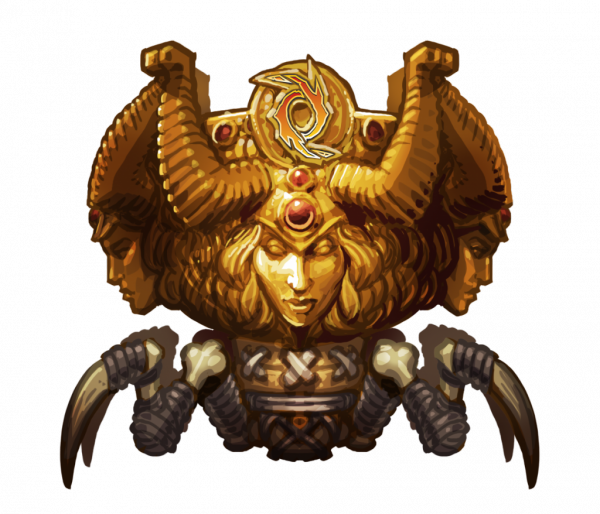

# Braggin Brawl #12

Posted on September 3 2015 by Gary

The Strategic Angels will be defending the Braggin’ Brawl trophy this Saturday, September 5th at 4:30pm GMT.

## What is the Braggin’ Brawl?
The Braggin’ Brawl is a friendly competition between Scrolls guilds. Teams of five battle against one another until only one team remains. This month’s tournament will be streamed in its entirety on The Badger Guild’s Twitch channel, cast by none other than Smogan himself.

Not in a guild? Don’t worry, this time everyone who is not in a guild will be organized into an extra “fourth team.” Head here for more information, and good luck!

*Edit: The Brawl is over! Read below to find out who won.*

# Update: New champions
Congratulations to The Badger Guild for retaking the Braggin’ Brawl trophy! This victory marks eleven total championships for the Badgers. The winning team of _antirad_, Blinky, Dialex, DaOvalord, and iScrE4m faced off against French Spirit in the finals, losing only three players in a King of the Hill format. Full brackets can be found here.

Thank you to everyone who participated!

-Gary(@Atmaz)