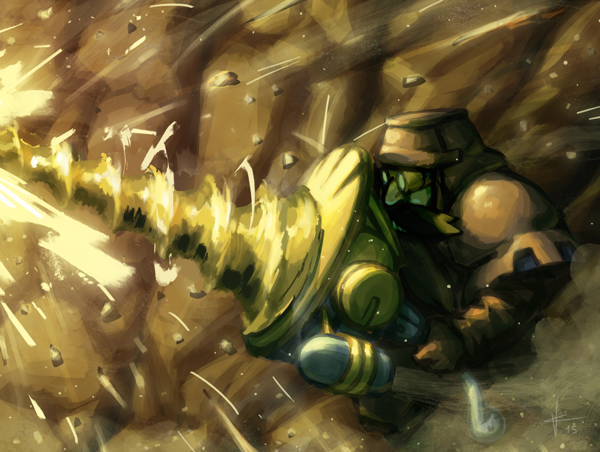

# Echoes balance

Posted on June 29 2015 by Gary

The big balance patch that started as a suggestion thread and ended with some post-Echoes balance adjustments is now live. Read on for the full list of changes.

# Changelog 1.4.0 (client 1.4.0)

## Scrolls
The changelog below is a consolidation of the last few previous patches on to the test server, with the addition of two new items. Beetle Stone will be getting placed back to its more familiar form with +2 Unstable, and there is a new custom match rule for surviving to a specific round.
* Arthritis (Decay): Now deals base Countdown as damage instead of 1.
* Bitter Root (Decay): Now has Poisonous. Health 3 (was 2).
* Atrophy (Decay): Now lasts until unit’s next attack (was until end of turn).
* Monstrous Brood (Decay): Reworked: Cost 5. Cost 5. Target creature you control and connected creatures are destroyed, and each is replaced by a Monstrosity.
* Morbid Curiosity (Decay): Cost 3 (was 2). Now draws a scroll when enchanted creature is destroyed.
* Infected Gravelock (Decay): Cost 1 (was 2), 2 Health (was 3).
* Pest Dissimulator (Decay): 2 Attack (was 1).
* Unforeseen Onslaught (Decay): Slayer now lasts until affected units’ next attack.
* Sanctuary of the Lost (Decay): Now also gives Magic resistance 1 to Undead.
* Atrophy (Decay): Atrophy debuff now expires when intended [bug fix].
* Beetle Stone (Decay): Added Unstable 2.
* Infectious Blight (Decay): Now properly goes in discard pile when leaving the battlefield [bug fix].
* Doomteller (Decay): Game now ends properly after winning with Doomteller [bug fix].
* Supercharged (Energy): Now activates when it comes into play in addition to start of turn.
* Catapult of Goo (Energy): Cost 2 (was 3).
* Ember Bonds (Energy): Now deals 3 damage (was 2).
* Snargl (Energy): 5 Health (was 4).
* Snargl Brain (Energy): Now gives +3 Health (was 2).
* Inferno Blast (Energy): Cost 2 (was 3).
* Gravelock Burrows (Energy): Now has Linger 8 (was 5).
* Metal Heart (Energy): Reworked: Cost 2. Enchanted creature counts as an Automaton, and its Attack is increased by the number of other Automatons you control.
* Golem Skin (Energy): Now deals 1 damage to your structures (was 2).
* Electrify (Energy): Cost 3 (was 2). Now attacks for 2 damage (was 1).
* Siege Cracker (Energy): 4 Health (was 3).
* Rigged (Energy): When enchanted structure is destroyed, opponent units on the same row are dealt 2 physical damage.
* Blast Strike (Energy): Cost 1 (was 2).
* Scattergunner (Energy): Attack 5 (was 4).
* Gravelock Elder (Energy): Attack 4 (was 3).
* Excogitator (Energy): Cost 6 (was 5).
* Wind-up Automaton (Energy): 2 Health (was 3).
* Rigged (Energy): Text now clearly states its effect only triggers when destroyed in combat [bug fix]..
* Vitriol Aura (Growth): Now has Poisonous (used to only poison on attacking).
* Illthorn Seed (Growth): Now gives Spiky 1 to enchanted unit.
* Ancestral Pact (Growth): Linger 5 (was 4).
* Totem Mask (Growth): Cost 3 (was 5). Now gives +2 Attack and +1 Health (was +2/+2) when structures come into play.
* Essence Feast (Growth): Reworked: Cost 4. Idols you control are healed by 1. Beasts get +2 Attack until end of turn. Draw 1 Beast.
* Hymn (Growth): Reworked: Cost 1. Now has an Inferno Blast-like area. Affected units are healed by 3.
* Elan Vital (Growth): Regeneration 2 (was 1).
* Bountiful Times (Growth): Cost 2 (was 3).
* Unground (Growth): Now rounds up instead of down.
* Gusty Izulr (Growth): 6 Health (was 5).
* Frostbeard (Growth): Now triggers when destroyed on opponent’s turn (was ‘when destroyed in combat’).
* Sister of the Bear (Growth): 5 Attack (was 4).
* Outcast Rebel (Growth): Now has Inspiring: +1 Attack.
* Owl (Growth): 2 Health (was 1).
* Consolidator Niara (Growth): 4 Attack (was 2). Buff now only gives +1 Attack.
* Outcast Rebel (Growth): 2 Health (was 3). Now has Inspiring +1 Attack.
* Breaker (Growth): Now gets +1 Attack and +1 Health after dealing damage.
* Fierce Tactics (Growth): Now additionally gives opponent ranged units Curse 1 until end of turn.
* Leeching Ring (Growth): Now heals by Attack value (used to heal by 2).
* Callback (Order): Cost 3. Target unit you control is returned to your hand, and your current Order is increased by the unit’s cost.
* Wings Soldier (Order): 2 Attack (was 3). Now has Creature strike 2.
* Stormknight (Order): 5 Health (was 4).
* Wings Sorceress (Order): Ability now removes all enchantments and effects (used to only remove last).
* Fields of Strife (Order): Cost 2 (was 3).
* Soldier’s Bond (Order): Now counts down other units on the same row (used to be units behind it).
* Faith Blessing (Order): Reworked: Cost 2. Target unit you control takes 2 magic damage. Your opponent’s idol on that row is dealt 2 damage, and your idol is healed by 2.
* Just Conviction (Order): Reworked: Cost 2. When a Soldier you control is destroyed, its Attack is added to a random adjacent creature until its next attack.
* Crown of Strength (Order): Enchanted unit now counts as a Knight.
* Plate Armor (Order): Now gives +2 Health (was +1).
* Mystic Altar (Order): Cost 2 (was 3).
## Custom Matches
* Can now play the same custom match again after losing against the AI.
* Added background(backgroundName) – backgroundName is the same names as in the Settings menu, for example ‘grasslands’.
* Added chooseDifficulty() – lets the user choose the AI difficulty of the challenge.
* Added ecSurvive(toRound) – player wins the match if they survive until the specified round.
## Miscellaneous
* Custom skirmish matches now have a check box next to them if completed.
* Custom game search field is no longer cleared when entering a match.
* Updated Judgement scroll weights to make comeback scrolls more common, and treaties more uncommon.
* Tier 2 and 3 scrolls now give 3x and 9x more gold when sold to the shopkeeper.
## Bug Fixes
* Now shows more matches in the replay list when filtering by game type.
* Fixed a number of sifting-related bugs.
* Fixed bug with multiple whisper chat rooms from the same user.
* The Judgement deck builder no longer sorts scrolls by resource.
* AI can now properly use limitless wild.
* Sleep Moratorium now takes taxing into consideration.
* Fixed rated custom games sometimes not showing their rating.
* Magma Thrower now has a proper attack animation.
* Spectated matches should no longer desynchronize.
* Fixed bugs related to avatars and idols in replays.