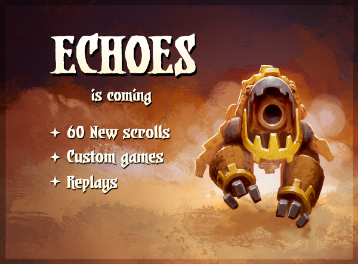
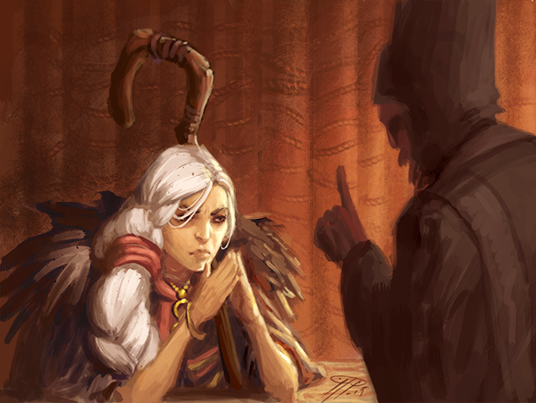
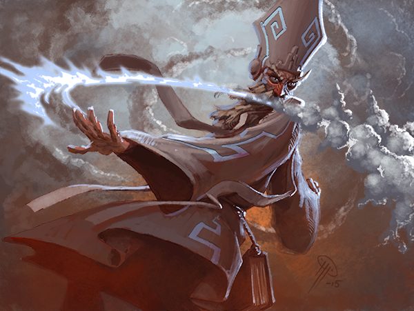

# Echoes is coming

Posted on May 28 2015 by Måns Olson

 
Hello folks,

We’re happy to announce that Echoes is almost here. On Tuesday, June 9th, we’ll release the full set, along with the myriad other changes we’ve made on the test server. Read on for more details!

# 60 brand new scrolls
With Echoes finally live, you’ll have 60 brand new scrolls to earn and put in your decks. Whether you find them, open an Explorer’s pack, or buy them on the black market, getting up to speed is easier than ever.

# Ranked resets
As usual, the release of Echoes means we’ll reset the ranked ladder – but that’s not all! We’ve set it up to automatically reset every two months, hopefully creating an active and dynamic ladder. As with every previous season, the top 25 players receive the special feathered avatar head.

# Ranked rewards
We’ve adding special avatar parts that are rewarded at the end of every week to the top 50 people on the ladder – the higher up you are, the more parts you’ll get.  Time to show everyone you’re the best.

# Custom matches
You can now play matches with custom rules against the AI or your friends. Finding great custom matches created by others is easy, and we’re letting you choose between popular or recent rulesets. Creating new ones is admittedly a little involved – somewhat akin to coding – but we’re certain you’ll create amazing things!

# Replays
You can now replay your matches, perhaps revelling in the glory of a recent victory. Better still, you can watch others as they no doubt fail to catch up with you on the ladder. Be aware that for now, replays are only saved for a limited time (around 9 days). Replays follow the same rules as your spectator settings. If you played a match with spectators allowed, that also means that others can replay the match later on.

# Gold! Scrolls! Stuff!
Rewards for playing matches are more generous than ever. The gold rewards have been raised significantly, and playing against the AI or in matchmaking multiplayer makes you eligible for random scroll drops.

# Wild Judgement
Judgement has truly found its way into the wild. Sacrifices for Wild are now entirely unlocked, meaning you’re free to mix and match your deck from the different factions. We’ve also lowered idol health slightly for a faster, punchier game mode. It’s fun!

# More enchantment shininess
After a long and arduous journey, we’ve finally arrived where we always meant to be: At a place where enchantments are clearly visible regardless of the battle background. Huzzah!

# New preconstructed decks
We’re adding two new preconstructed decks to the store. There’s a lot of them by now.

# Improved battle feedback
Hovering cards in the card history now helps indicate which tiles or units were affected, letting you keep up to date even if you missed the action. Further, when you’re being spectated, you can click the eye to see who’s watching your match.

That’s all for now. See you on the battlefield!

Måns – @MansOlson