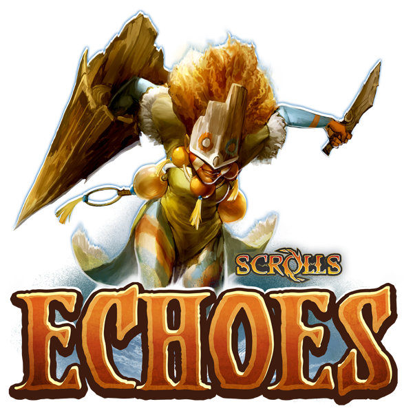
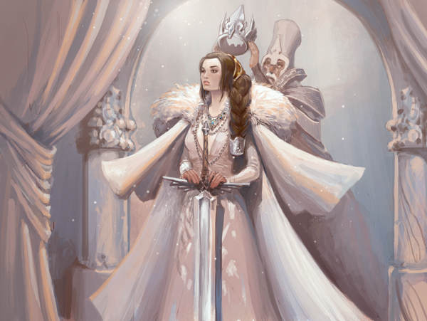
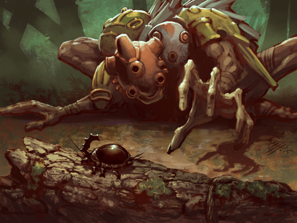
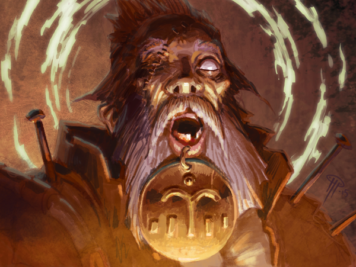
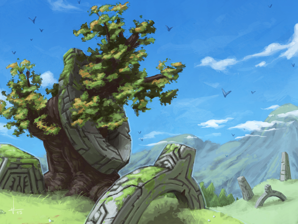

# Echoes is live! Scrolldiers, join the expedition.

Posted on June 9 2015 by Måns Olson

Great expeditions are being launched from every corner of the world. Mighty caravans venture out of the Empire, hunting parties roam the forests of Khaile, and tunnels are dug in faraway Dyrra. Converging on the highlands far north of Aes Mora, they all seek the echoes of a distant past.

Echoes is our latest set of 60 scrolls. With it comes replays, custom matches, a wild new Judgement mode, and plenty more. For a full breakdown, have a look at our previous post or see the changelog after the break.

Scrolldiers – join the expedition!

# Changelog 1.3.0 (client 1.3.0)
Introducing our new set: Echoes! This includes 60 all-new scrolls, replays, custom matches, new Judgement, and much more.

Explorer’s packs have been updated to Echoes (no longer has increased chance to give Waypoints scrolls)

A large balance patch for existing scrolls is being worked on, and should go live in the near future.

## Scrolls
Added 60 Echoes scrolls. Huge congratulations to the winners of the Echoes scroll design competition: **TheJakyll**, **gaver10**, **uwlryoung**, and **EyeTheta**!

* Gravelock Freak (Energy): Now only triggers off units you control.
* Golem Skin (Energy): Fixed a crash bug in trials (bug fix).
* Feedback Jolt (Energy): Reworked: Cost 3. Each opponent unit is dealt 2 magic damage per attached enchantment. Reasoning: We’re hoping it will better counter stacked enchantments, without hampering viability of regular decks with enchantments.
* Shroud of Unlife (Decay): The added Undead subtype can no longer be removed by Purification or similar.
* Bog Hound (Decay): Dominion: +3 Attack (was 2).
* Slithering Form (Decay): Now has Magic resistance 2.
* Unbind (Decay): Reworked: Cost 3. Destroy target enchanted unit.
* Flesh Animator (Decay): Now only counts down your own Undead.
* Anima Conduit (Decay): Fixed a bug where it could spawn too many units (bug fix).
* Halls of Oum Lasa (Decay): Fixed a bug where it would cause a crash in the latest test patch (bug fix).
* Efficiency (Order): +2 Attack (was 1).
* Pother (Order): Changed its interaction with Lockling Brood to be more consistent with things like Burn and Soul Steal.
* Caravans of the Expanse (Order): Now has Dominion: +1 Attack to your units, and activates other Dominion traits.
* Wings Charger (Order): Now has 5 Health (was 4).
* Eternal Sword (Order): Fixed a duplication issue in trials (bug fix).
* Prisoners of War (Order): Updated text to better match the rules (bug fix).
* Brother of the Wolf (Growth): Now counts up by 2 instead of resetting Countdown when activating ability.
* Berserker (Growth): Now has 5 Health (was 4).
* Nog Nest (Growth): Can no longer be saved from self-destruction with Appurtenance.

## Ranked reset
* We’ve reset the ladder. Now’s your chance to reach the top! Starting now, and every 8th week (synchronized with weekly rewards), the ladder will be automatically reset.

## Rewards
* Gold rewards for Skirmish, Quick, and Ranked matches has been significantly increased. Additionally, you now have a chance of earning a scroll after finishing a match without surrendering.
* Judgement reward levels have been increased.
* Added avatar part rewards for the top 50 players on the ladder each week.
* Added avatar part rewards for the top 25 players on the ladder at the end of each season.

## Custom matches
* Added custom matches. This is a feature that lets you define custom rules for the match before it is played, and play with them against the AI or a friend.
* Starting a custom match can only be done from the PC client, but mobile users can accept custom match invites from others.
* More information about custom matches can be found here.
 

## Replays
* Added replays to the ‘Watch games’ view [PC only].
* The replay control bar can be hidden or shown by pressing F3.
* Keyboard control: Left arrow to start over, right arrow to fast forward, up arrow to pause/unpause.
* Replays are saved for up to 9 days before being deleted.
* Replay visibility is based on your spectator setting at the time the match is played. For example, if your setting at the time was ‘Allow, but hide chat’, any user can replay the match, but won’t see your chat.
* Replays are not guaranteed to be compatible between versions.

## Judgement
* Judgement has been reworked. You can now sacrifice freely for Wild, and idols have 6/8/10/8/6 Health.
* You now pick only 35 scrolls when drafting the pool for your Judgement deck (instead of 45).
* Some scrolls have been individually weighted to be less common in Judgement (mostly ramp, Surge, and powerful commons).
* You can now view your Judgement deck (but not your sideboard) by clicking Judgement in the Arena, and then choosing ‘Deck options’ -> ‘View deck’ [PC only].

## Miscellaneous
* Made enchantment glow more visible (!)
* Added two Echoes preconstructed decks to the store.
* Added several new Echoes decks to the Hard AI, courtesy of Atmaz and Blinky.
* Clicking the spectator icon in the top right corner of the battle screen now shows who’s watching you.
* You can now sell up to 20 scrolls on the Black Market (up from 10).
* Increased max number of users in chat rooms to 100.
* Hovering the card history in matches now shows visual indicators on the board. This is still work in progress.
* Test server should now always be open to everyone (bug fix).
* Removed Herobrine (bug fix).
 

##  Bug fixes
* The timer for upcoming matches is now back in the Watch Live Games screen.

## Hot off the press
Most of the above changes have been on the test server for some time. Below are a few last-minute tweaks and balance changes that were not included in the latest test server patch.

* Blast Automaton (Energy): 2/2/4 (was 3/2/3).
* Wind-up Automaton (Energy): Now costs 3 to activate ability (used to cost 2).
* Controlled Lightning (Energy): Cost 2 (was 3).
* Battle Dance (Energy): Cost 4 (was 3).
* Gloomstone Treaty (Decay): Now only works during opponent’s turn.
* Stone Recluse (Growth): Now gives +2 Attack and Relentless when pillaging (was +3 and Relentless).
* Custom matches: Added nextGame(author, levelName). Adds a ‘Play next’ button leading to another custom match, shown if you win.
* Custom matches: Added buffUnit(playerSide, cardName, row, column). Buffs a specific unit at the start of the game.
