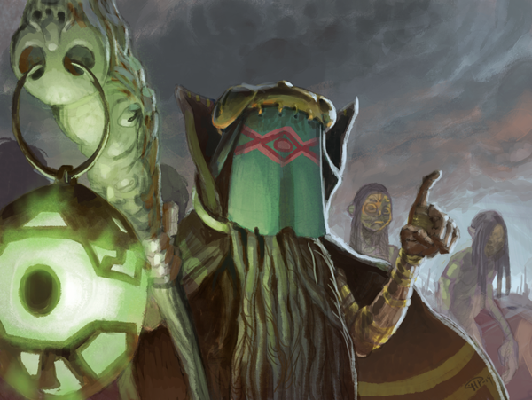

# Greetings fellow citizens of the internet!

Posted on September 30 2015 by Henrik Pettersson

This week we’re patching Scrolls. The patch has two purposes. Firstly, we’re tweaking the balance of a few cards, to smooth over the bumps after set 7. These are pretty minor tweaks, which is nice. Set 7 still shines as one of our best sets.

Secondly, due to updated legal requirements, effective today, users can no longer purchase shards. Purchasing full account upgrades is still possible, but only via mojang.com. If you attempt to upgrade from within the game, you will be redirected to the website.

**Please be aware that any existing shards will expire when the servers shut down on or after July 1st, 2016. If you have any shards on your account, be sure to use them before that time.**

Per popular request, we’re disabling the ‘Quick Match’ queue, and refer both premium and demo users to Ranked Match. Also, as mentioned in the Q&A earlier we’ve reached a point where we can no longer award Minecraft capes.

If you have any questions about the update, you can usually find a dev on twitter, or in the Scrollsguide IRC.

Best Regards,

/the Scrolls team