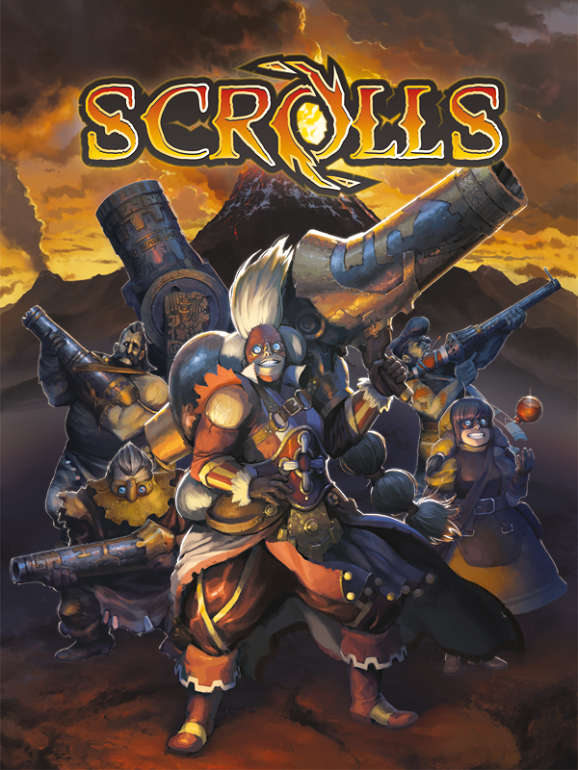

# It's been a Blast Automaton!

Posted on June 29 2015 by Scrolls

Hi everyone,

After much deliberation, we’ve come to an important decision that we’d like to share: Echoes will be the last major content patch for Scrolls. We won’t be adding features or sets from now on, though we are planning to keep a close eye on game balance.

Scrolls will still be available to purchase for the time being, and our servers will run until at least July 1st, 2016. All future proceeds will go towards keeping Scrolls playable for as long as possible.

The launch of the Scrolls beta was a great success. Tens of thousands of players battled daily, and many of them remain active today. Unfortunately, the game has reached a point where it can no longer sustain continuous development.

We’ve had a great time working on Scrolls, and appreciate every last player who’s downloaded our game. Extra big thanks to the most dedicated members of our community; some of you have logged in almost every day since release and dedicated a large portion of your time to dominating the leaderboards and taking care of new players. We salute you, honourable scrolldiers.

We will do our best to answer any questions you might have on the standard channels.

Thanks for reading, everybody.

The Scrolls team <3