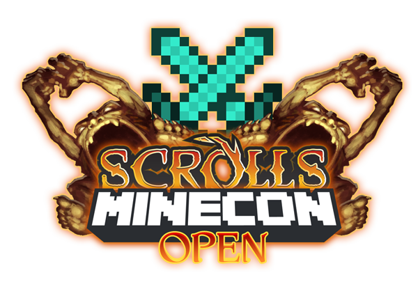
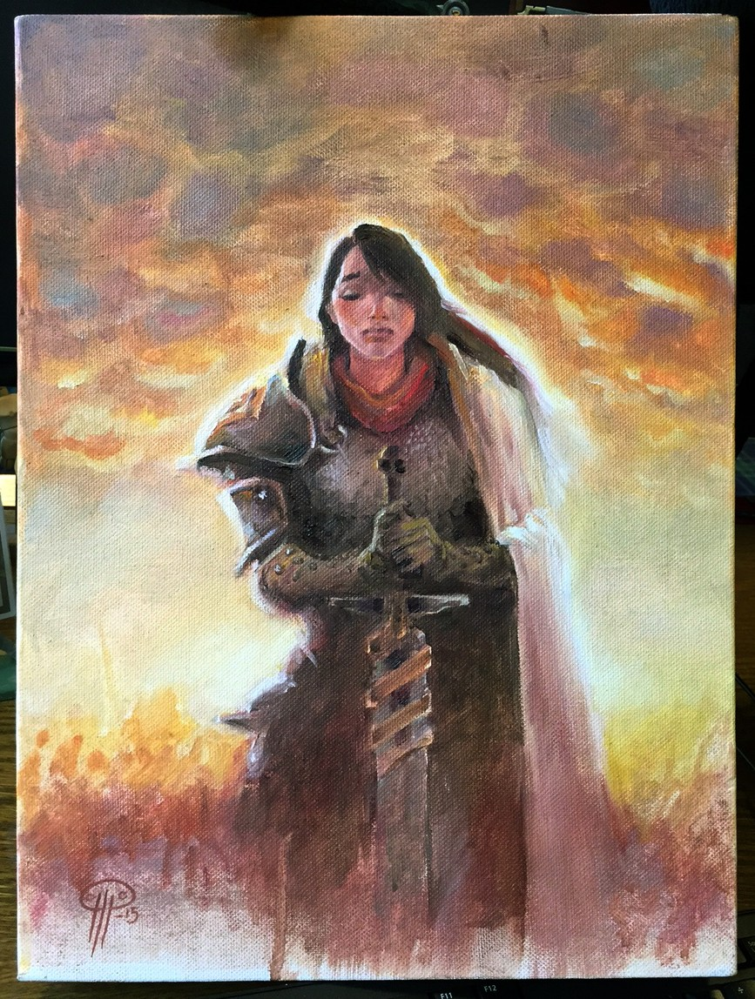

# MINECON Open registration and prize updates

Posted on June 16 2015 by Gary

The first qualifier for the MINECON Open takes place this Sunday, June 21st, at 16:00 GMT. We’ve also added some new prizes for the finals! Read on to find out how you can participate.

# Registration is now open closed
Participants must check in the day of the tournament between 15:00-15:45 GMT in the in-game channel “Minecon.” Any questions can be directed to Atmaz in game, or by email at atmaz@scrolls.com.

## REGISTRATION IS CLOSED
You must register before 22:00 GMT the day before each qualifier, at which time ranked ratings will be recorded for bracket seeding purposes.

 

# New prizes
We’ve been working on making the prizes for the finals as special as we can. With the help of carnalizer, we now have what can be considered the official Grand Prize. First place will receive a one-of-a-kind real life painting of the scroll: Focus.

In addition to this, we’ve also added some Scrolls T-Shirts to the prize pool and some special Ducal Skirmisher postcards signed by the Scrolls team. We’ve also increased the amount of gold and Scroll rewards by quite a large margin. Finally, we’re looking to throw in some MINECON merchandise, but we don’t have any specifics on that quite yet. Don’t be surprised if even more is added to this list in the future!

## Finals:
* 1st Place:
    * 25,000 gold
    * Scrolls: Twenty Tier 3 Scrolls of choice
    * Tournament Head awarded
    * Ducal Skirmisher postcard signed by the Scrolls team
    * Scrolls Minecraft Cape
    * Scrolls T-Shirt
    * One-of-a-kind real life Focus painting by carnalizer
* 2nd Place:
    * 15,000 gold
    * Scrolls: Twenty Tier 2 Scrolls of choice
    * Tournament Head awarded
    * Ducal Skirmisher postcard signed by the Scrolls team
    * Scrolls Minecraft Cape
    * Scrolls T-Shirt
* 3rd Place:
    * 10,000 gold
    * Scrolls: Twenty Tier 1 Scrolls of choice
    * Tournament Head awarded.
    * Ducal Skirmisher postcard signed by the Scrolls team
    * Scrolls Minecraft Cape
    * Scrolls T-Shirt
* 4th Place:
    * 7500 gold
    * Scrolls: Ten Tier 1 Scrolls of choice
    * Tournament Head awarded.
    * Scrolls Minecraft Cape
 

# ESL Echoes Opening Cup results

In other Scrolls tournament news, congratulations to the winners of last Sunday’s ESL Echoes Opening Cup:

* 1st: **ktrey**
* 2nd: **Blinky**
* 3rd: **ARN64**
* 4th: **alvarpq**

-Gary(@Atmaz)