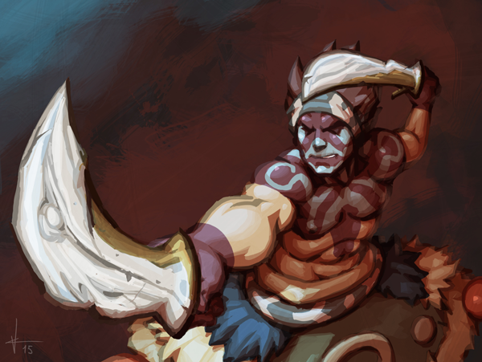

# MINECON Open results

Posted on July 7 2015 by Gary

The MINECON Open is officially over! Thanks to everyone for participating and to those who joined us in London. Read on to find out who finished at the top.

# MINECON Open champions
After two days of eight players battling it out, only one champion could be crowned.

Congratulations to the first place finisher of the 2015 Scrolls Minecon Open:

### Nrp123

You may know him as **NrpTheNinja**, or maybe simply Nrp. You may pronounce his name as “Nerp,” or you may say “N.R.P.” – but one thing is for certain: Nrp’s Scrolls achievements were already extremely impressive, and this championship with a sweeping 3-0 victory over **\_antirad\_** solidifies him as one of the best Scrolls players of all time.

Let’s not take away from the rest of our finalists, however. Great games were had all around, and everyone who had an appearance in the finals produced an excellent performance.

* 2nd place: **\_antirad\_**
* 3rd and 4th place: **ChiefBromden and Magpieman**

Instead of having a match for 3rd place, the players requested to split the [prizes](). Since we didn’t really want to cut a T-shirt and postcard in half, we decided to more than honor their request by providing an additional T-shirt and postcard between them. These players deserve it, anyway.

# MINECON afterthoughts
I just got back from London today. My thoughts are still forming themselves – but, overall, Minecon was a blast (automaton). We have a small selection of photos posted here. The Scrolls booth went exceptionally well, and it really was a joy to see people playing Scrolls for the first time on our Demo computers and having a genuinely good time. With the mentorship of Gareth, Blinky, Acidjib, Hopefighter, and even Måns and Carnalizer, our booth was always occupied with players experiencing Scrolls for the first time.

As an example: The very last day, ten minutes before the closing ceremony of MINECON, a player asked me in a pleading voice: “Do I have time for another Skirmish?”

“Yes,” I said, “but you better hurry up!”

He happily obliged and got right into the next game, trying to take a win off the easy AI after having a tough time against a Catapult of Goo. You could just look at him and see how fully absorbed he was in the game. There were many more like him, but he in particular will stick in my memory for quite some time. They came, they played, and they had fun.

## The “Tournament Zone”
Our presentations of the MINECON Open in what was called the Tournament Zone went very well. With the help of **Blinky** and **Hopefighter**, we were able to present high level Scrolls play on a big screen to those who, for the most part, had never seen the game played before.

We are still working at getting these videos uploaded. We streamed the games up until the semi finals live from our booth. Unfortunately, due to a critical failure of a hard drive from the convention, it is likely that we won’t be able to recover the semi-final presentation on stage. The good news is that we have a full recording of the finals between **Nrp123** and **\_antirad\_**. You can expect this to be up on **Blinky’s** Youtube channel soon, complete with my nearly exhausted voice. Please understand that these games were presented in a very basic fashion to the audience – so if you are used to extremely detailed commentary and analysis, you may find it lacking. Luckily, members of community stepped up and commentated these games at a more analytical level live over the internet for those who were interested. Thank you, **Squiddy** and **Zylus**!

 

Overall, it was an amazing weekend full of plenty of smiles.

It’s been my pleasure, folks.

-Gary (@Atmaz)