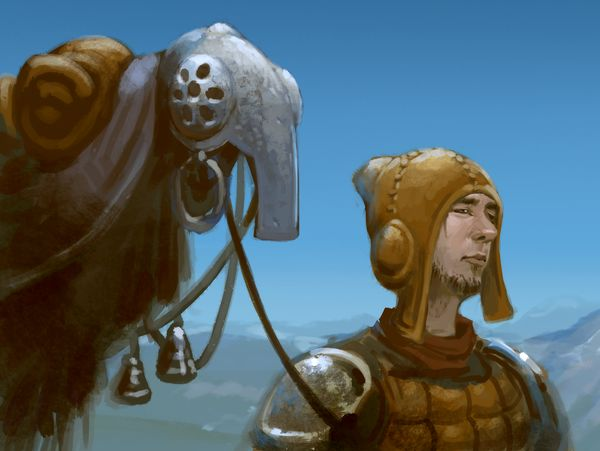

# Minor Bugfix Patch

Posted on March 13 2019 by Måns Olson

Hello Scrolldiers,

We've just finished a minor update - 2.0.1 - for both the client and the server. This is a stability patch that should be backwards compatible with version 2.0.0. A few issues have been fixed, including not being able to play challenge matches with other players.

## Downloading the update
To get the update, go to the [download page](../README.md) and grab the latest version.

## 2.0.1 Changelog
* Client: Fixed players not being able to challenge each other
* Client: Fixed rejoining chat channels after matches sometimes not working
* Client: Fixed an issue where chat sounds from channels you couldn't see would sometimes play during matches
* Server: Users can no longer have spaces in names
* Server: Fixed ranked top list and black market offers being sorted incorrectly
* Server: Server can now configure the rate at which players are matched in matchmaking (via the database - see instructions file contained in the zip)

See you on the battlefield!

Måns
