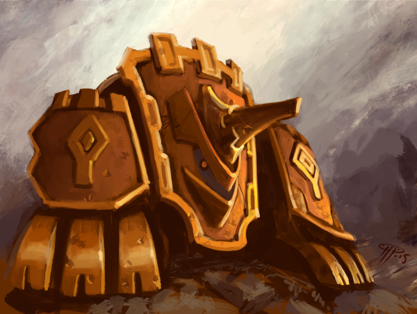

# Ranked reset

Posted on June 8 2015 by Gary

With Echoes releases comes the introduction of automated ladder seasons. Read on to find out exactly how this will affect the current ranked ladder, and how the new automated seasons will be structured.

# Ladder season ending tonight
As mentioned in the Echoes announcement post, we will be resetting the ladder with Echoes’ release. However, we will be officially ending the current ladder season at Midnight UTC tonight. We know it’s short notice, but the new automated system won’t kick in until the Echoes patch is live. That means we still have to do it one last time the old fashioned way: Manually.

Since this is the last manual end of a season, and we were unable to give what we feel is sufficient advanced notice, we feel it’s fair to award the top 25 season heads a little differently this time.

Firstly, the Top 25 players shortly before the time of this posting have already been recorded. All 25 will receive the ladder season head if they do not already have it. Those 25 players are:

* **sysp**
* **Holofoil**
* **\_antirad\_**
* **GiaLoTa**
* **Nrp123**
* **Zadrim**
* **Caller_Outkast**
* **Actionholic**
* **Alpha_Century**
* **Vetscroll**
* **Rock_Jesus**
* **Bronol**
* **Dzees**
* **ChiefBromden**
* **Eva**
* **Azara**
* **ShamblerKing**
* **DaOvalord**
* **Owl_Sage**
* **Solaus**
* **Blinky**
* **Donkey74**
* **Dialex**
* **Demmiremmi**
* **Ikraen**

Secondly, we are going to take another snapshot of the ranked ladder at Midnight UTC and award those 25 players the ladder head if they do not already have it. This means you still have a chance to overtake anyone on the top 25 and earn a head before the season is over. We are doing this to be as fair as possible to those who have worked hard at maintaining their top 25 position and may not have enough advanced notice to defend their spot.

# New season begins tomorrow
Tomorrow, when Echoes heads to live servers, the automated ranked seasons will begin. They will operate in 8 week cycles in conjunction with the Weekly Winner announcement that occurs every Sunday at 8pm UTC.

However, since we are patching on a Tuesday, we are manually setting the first season to end on Sunday, August 2nd, which is just short of 8 weeks. After that, seasons will reliably end every 8 Sundays from that date. If you’re doing the math, that means the next ladder reset will then be Sunday, September 27th.

Make sense?

Sorry for any confusion, and we are looking forward to Echoes’ release tomorrow, June 9th!

 

-Gary(@Atmaz)