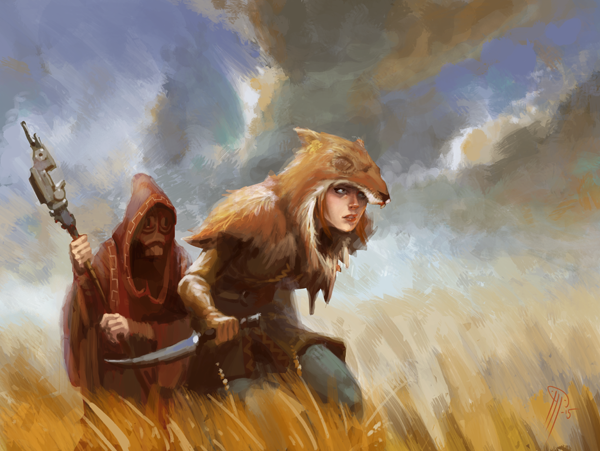

# Test Server – Echoes balance

Posted on June 16 2015 by Gary

A large batch of balance changes and miscellaneous fixes/adjustments have sneaked their way on to the test server. Over 50 scrolls are seeing a change! Read on to see the complete list.
 
# Changelog 1.3.2 (client 1.3.2)
## Scrolls
* Arthritis (Decay): Now deals base Countdown as damage instead of 1.
* Bitter Root (Decay): Now has Poisonous. Health 3 (was 2).
* Atrophy (Decay): Now lasts until unit’s next attack (was until end of turn).
* Monstrous Brood (Decay): Reworked: Cost 5. Cost 5. Target creature you control and connected creatures are destroyed, and each is replaced by a Monstrosity.
* Morbid Curiosity (Decay): Cost 3 (was 2). Now draws a scroll when enchanted creature is destroyed, in addition to previous effect.
* Infected Gravelock (Decay): Cost 1 (was 2), 2 Health (was 3).
* Pest Dissimulator (Decay): 2 Attack (was 1).
* Unforeseen Onslaught (Decay): Slayer now lasts until affected units’ next attack.
* Unbind (Decay): Cost 4 (was 3).
* Supercharged (Energy): Now activates when it comes into play in addition to start of turn.
* Catapult of Goo (Energy): Cost 2 (was 3).
* Ember Bonds (Energy): Now deals 3 damage (was 2).
* Snargl (Energy): 5 Health (was 4).
* Snargl Brain (Energy): Now gives +3 Health (was 2).
* Inferno Blast (Energy): Cost 2 (was 3).
* Gravelock Burrows (Energy): Now has Linger 8 (was 5).
* Metal Heart (Energy): Reworked: Cost 2. Enchanted creature counts as an Automaton, and its Attack is increased by the number of other Automatons you control.
* Golem Skin (Energy): Now deals 1 damage to your structures (was 2).
* Electrify (Energy): Cost 3 (was 2). Now attacks for 2 damage (was 1).
* Siege Cracker (Energy): 4 Health (was 3).
* Rigged (Energy): When enchanted structure is destroyed, opponent units on the same row are dealt 2 physical damage.
* Blast Strike (Energy): Cost 1 (was 2).
* Scattergunner (Energy): Attack 5 (was 4).
* Gravelock Elder (Energy): Attack 4 (was 3).
* Vitriol Aura (Growth): Now has Poisonous (used to only poison on attacking).
* Illthorn Seed (Growth): Now gives Spiky 1 to enchanted unit.
* Ancestral Pact (Growth): Linger 5 (was 4).
* Nutrition (Growth): Cost 2 (was 1). Now has Replenish.
* Erode (Growth): 3 damage (was 2).
* Leeching Ring (Growth): Now fully heals attacker (used to heal by 2).
* Totem Mask (Growth): Cost 3 (was 5). Now gives +2 Attack and +1 Health (was +2/+2) when structures come into play.
* Essence Feast (Growth): Reworked: Cost 4. Idols you control are healed by 1. Beasts get +2 Attack until end of turn. Draw 1 Beast.
* Hymn (Growth): Reworked: Cost 1. Now has an Inferno Blast-like area. Affected units are healed by 3.
* Elan Vital (Growth): Regeneration 2 (was 1).
* Bountiful Times (Growth): Cost 2 (was 3).
* Unground (Growth): Now rounds up instead of down.
* Gusty Izulr (Growth): 6 Health (was 5).
* Frostbeard (Growth): Now triggers when destroyed on opponent’s turn (was ‘when destroyed in combat’).
* Sister of the Bear (Growth): 5 Attack (was 4).
* Outcast Rebel (Growth): Now has Inspiring: +1 Attack.
* Owl (Growth): 2 Health (was 1).
* Callback (Order): Target unit you control is returned to your hand, and your current Order is increased by the unit’s cost.
* Wings Soldier (Order): 1 Attack (was 3). Now has Creature strike 3.
* Stormknight (Order): 5 Health (was 4).
* Wings Sorceress (Order): Ability now removes all enchantments and effects (used to only remove last).
* Fields of Strife (Order): Cost 2 (was 3).
* Soldier’s Bond (Order): Now counts down other units on the same row (used to be units behind it).
* Faith Blessing (Order): Reworked: Cost 2. Target unit you control takes 2 magic damage. Your opponent’s idol on that row is dealt 2 damage, and your idol is healed by 2.
* Just Conviction (Order): Reworked: Cost 2. When a Soldier you control is destroyed, its Attack is added to a random adjacent creature until its next attack.
* Crown of Strength (Order): Enchanted unit now counts as a Knight, in addition to previous effects.
* Plate Armor (Order): Now gives +2 Health (was +1).
* Mystic Altar (Order): Cost 2 (was 3).
## Miscellaneous
* Custom skirmish matches now have a check box next to them if completed.
* Custom game search field is no longer cleared when entering a match.
* Reworked the end screen to make it more attractive.
* Updated Judgement scroll weights to make comeback scrolls more common, and treaties more uncommon.
## Bug Fixes
* Now shows more matches in the replay list when filtering by game type.
* Fixed a number of sifting-related bugs.
* Fixed bug with multiple whisper chat rooms from the same user.
* The Judgement deck builder no longer sorts scrolls by resource.
* AI can now properly use limitless wild.
* Sleep Moratorium now takes taxing into consideration.
* Fixed rated custom games sometimes not showing their rating.
* Magma Thrower now has a proper attack animation.
 

# More on Judgement weight changes
We recognize the power of a few of the remaining unweighted treaties and made them a little harder to get. Consolidator Niara also saw a similar change.

On the other hand, we’d like to increase the availability of certain “comeback” scrolls. This means you should be able to include more of these in your deck if you’d like, and expect that your opponent may likely have them as well.

The following are the exact weights that have been applied:

* Consolidator Niara 25%
* Gloomstone Treaty 25%
* Border Treaty 25%
* Thundersurge 200%
* Blind Rage 200%
* Quake 200%
* Frost Gale 200%
* Inferno Blast 150%

# Accessing the Test Server
Everyone has access to the test server. You can access the Test Server by starting the Scrolls launcher, clicking “More Options”-> “Play Test Server”.

Have fun!

-Gary(@Atmaz)