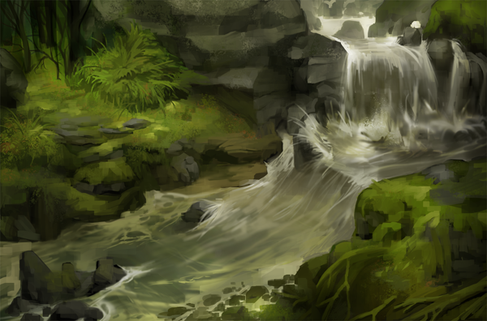

# Test server: Echoes – Balance tweaks

Posted on May 28 2015 by Gary

The initial wave of Echoes balancing has worked its way onto the test server, along with a few other interesting changes to custom matches and the beginnings of a much requested improvement to enchantment effects. Click the stream to find out more!

# Changelog 1.2.12 (client 1.2.12)
## Scrolls
* Spotted Lynx (Growth): Countdown 3 (was 2).
* Overgrown Menhir (Growth): Cost 3 (was 2).
* Verdant Remnant (Growth): Cost 5 (was 4), Health 5 (was 4).
* Hunter’s Treaty (Growth): Linger 3 (was 4).
* Earthen Splendor (Growth): +2 Health (was 1).
* Blast Automaton (Energy): 3 Health (was 4).
* Lightning Chest (Energy): Linger 5 (was 4)
* Magma Thrower (Energy): Fixed attack animation (bug fix). (note: bug fix is bugged)
* Excogitator (Energy): Activation cost 3 (was 2).
* Golem Skin (Energy): Fixed a crash bug in trials (bug fix).
* Imperial Scepter (Order): Cost 5 (was 6).
* Mystic’s Storm (Order): Lingering spells you control count up by 2 (was 3), opponent’s count down by 3 (was 2).
* Pack Fowl (Order): Fixed dominion effect not working properly (bug fix).
* Gloomstone Treaty (Decay): Linger 5 (was 6).
* Bog Hound (Decay): Dominion: +3 Attack (was 2).
* Corpse Strider (Decay): Only triggers on Undead you control (used to trigger on both sides).
* Miremare (Decay): Dominion: +2 Attack on and +3 Health (was +3/+3).
* Shroud of Unlife (Decay): The added Undead subtype can no longer be removed by Purification or similar.
* Corpse Theft (Decay): No longer works on structures (bug fix).
## Custom matches
* Added mustComplete(authorName, customMatchName) – Lets you chain custom matches so that a previous one has to be completed to play this one (single player only).
* Added hide() – Lets you hide your custom match from the public while working on it.
* Added ecDestroyIdols(playerSide, numberOfIdols) – Changes the end condition – match is won by player when numberOfIdols idols are destroyed.
* Added ecClearAll(playerSide) – Changes the end condition – match is won by player when the opponent’s side is cleared.
* Added ecKillUnit(playerSide, row, column) – Changes the end condition – match is won by player when the unit that started on a specific tile is destroyed.
* Added difficulty(none) – Makes AI passive (does not take actions).
## Replays
* The replay control bar can now be hidden or shown by pressing F3.
* Keyboard control: Left arrow to start over, right arrow to fast forward, up arrow to pause/unpause.
## Miscellaneous
* Made enchantment glow more visible (!)