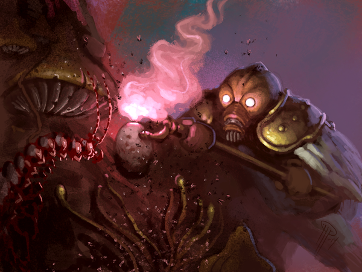
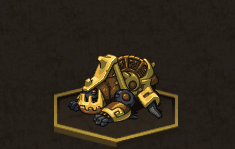

# Test Server – Echoes: Full set

Posted on May 21 2015 by Gary

It’s here. Handle it carefully. All remaining Echoes scrolls have been pushed to the test server. Brace yourselves and read on to get a full list of the new scrolls.

# Changelog 1.2.11 (client 1.2.11)
## Scrolls
* Added the remaining 20 Echoes scrolls.
* Corpse Strider
    * 2 Decay
    * Creature: Human, Mystic (2/2/1)
    * When an Undead is destroyed, Corpse Strider’s Attack and Health are increased by 1.
* Keeper’s Pledge
    * 2 Growth
    * Spell: Lingering
    * Linger 4. When a creature comes into play, other creatures on that side get +1 Attack until end of turn.
* Miremare
    * 2 Decay
    * Creature: Beast, Masked (2/2/2)
    * Dominion: +3 Attack and +3 Health.
* Overgrown Menhir
    * 2 Growth
    * Structure: Totem (0/-/2)
    * When a creature comes into play next to Overgrown Menhir, that creature’s Countdown is decreased by 1.
* Spotted Lynx
    * 2 Growth
    * Creature: Beast, Cat (3/2/2)
    * When an opponent creature comes into play, Spotted Lynx’s Countdown is decreased by 1.
* Steelwood Dedication
    * 2 Growth
    * Spell: Lingering
    * Linger 5. If a creature you control is dealt damage during combat, it is then healed by 3.
* Stirring Effigy
    * 2 Order
    * Structure
    * Resonance: A random adjacent creature gets +1 Attack.
* Wind-up Automaton
    * 2 Energy
    * Creature: Automaton (0/1/3)
    * Ranged Attack. Wind-up counts up instead of down at the beginning of its turn. Pay 2 Energy to increase Attack by Countdown until end of turn.     Countdown is set to 0.
* Just Conviction
    * 3 Order
    * Spell: Lingering
    * Linger: 5. Soldiers you control have +1 Attack.
* Magma Thrower
    * 3 Energy
    * Creature: Human (2/2/3)
    * Magma Thrower’s Attack is equal to your current Energy resource.
* Pack Fowl
    * 3 Order
    * Creature: Beast (3/2/3)
    * Dominion: While Pack Fowl is in play, Wild is increased by 2.
* Corpse Theft
    * 4 Decay
    * Enchantment
    * When enchanted creature is destroyed, an Undead copy of that creature is summoned on a random tile on your side.
* Doomteller
    * 4 Decay
    * Structure: Totem (0/4/4)
    * When Doomteller’s Countdown becomes 0, opponent idols take 2 damage.
* Blast Automaton
    * 5 Energy
    * Creature: Automaton (3/2/4)
    * Ranged Attack. Armor 2. When Blast Automaton damages an opponent in combat, adjacent units are dealt 1 damage.
* Excogitator
    * 5 Energy
    * Structure: Forge (0/3/5)
    * Unique. Instead of attacking, Excogitator summons a Scout Automaton on an adjacent tile. Pay 2 Energy to decrease Countdown by 1.
* Ka Zum Driller
    * 5 Energy
    * Creature: Human (3/2/3)
    * Pillage: The damaged idol is destroyed.
* Consolidator Niara
    * 6 Growth
    * Creature: Human (2/2/5)
    * Unique. Relentless. When you play a creature scroll with a subtype not on your side, creatures you control get +2 Attack until end of turn.
* Imperial Scepter
    * 6 Order
    * Structure (0/-/3)
    * Unique. Resonance: Adjacent units have their Countdown decreased by 1.
* Varas, Essence Eater
    * 6 Decay
    * Creature: Human, Mystic (3/2/6)
    * Unique. Relentless. Varas has +2 Attack for each destroyed idol on the board.
* Orz Disruptor
    * 7 Order
    * Creature: Human, Knight (5/2/5)
    * When a Human you control deals damage to a unit, opponent’s idol on that row is dealt 2 damage.

* Slithering Form (Decay): Now has Magic resistance 2.
* Favored (Order): Dominion effect now increases Attack by 5 (instead of by your Order).

## Replays
* Lobby chat is now available while watching replays.

## Custom matches
* Can now filter custom matches on titles or author.

You can find a convenient image gallery of all the new scrolls over at Scrollsguide. Thanks, Zylus!

# Accessing the Test Server
You can help us work out the bugs and tweaks in Echoes. Access the test server by starting your Scrolls launcher and selecting “More Options.” You’ll be presented with a big, fat “PLAY TEST SERVER” button. You’ll want to click that.

Who has access to the test server? Everyone!

Go hog wild.

-Gary(@Atmaz)