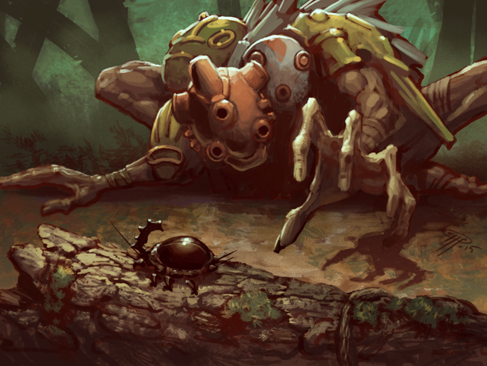

# Test server – More balance tweaks

Posted on June 26 2015 by Gary
 

This test server patch contains a little bit more post-Echoes tuning and a few miscellaneous additions and bug fixes. There’s also a surprise beetle! Click the Corpse Strider to learn more.

# Changelog 1.3.5 (client 1.3.5)
## Scrolls
* Nutrition (Growth): Reverted to previous version (cost 1, no Replenish).
* Erode (Growth): Reverted to previous version (2 damage).
* Consolidator Niara (Growth): 4 Attack (was 2). Buff now only gives +1 Attack.
* Outcast Rebel (Growth): 2 Health (was 3). (Still has Inspiring +1 Attack)
* Breaker (Growth): Now gets +1 Attack and +1 Health after dealing damage.
* Fierce Tactics (Growth): Now additionally gives opponent ranged units Curse 1 until end of turn.
* Leeching Ring (Growth): Now heals by Attack value instead of healing fully.
* Callback (Order): Cost 3 (was 4).
* Wings Soldier (Order): 2 Attack (was 1), Creature strike 2 (was 3).
* Unbind (Decay): Reverted to previous version (cost 3).
* Sanctuary of the Lost (Decay): Now also gives Magic resistance 1 to Undead.
* Atrophy (Decay): Atrophy debuff now expires when intended [bug fix].
* Beetle Stone (Decay): Reworked: Cost 2. 0/-/3. Magic reistance 3. When Beetle Stone comes into play, your opponent’s Lingering spells count down by 3.
* Excogitator (Energy): Cost 6 (was 5).
* Wind-up Automaton (Energy): 2 Health (was 3).
## Custom Matches
* Can now play the same custom match again after losing against the AI.
* Added background(backgroundName) – backgroundName is the same names as in the Settings menu, for example ‘grasslands’.
* Added chooseDifficulty() – lets the user choose the AI difficulty of the challenge.
## Miscellaneous
* Tier 2 and 3 scrolls now give 3x and 9x more gold when sold to the shopkeeper.
## Bug Fixes
* Spectated matches should no longer desynchronize.
* Fixed bugs related to avatars and idols in replays.
 

# More on balance
Let’s talk about the previous couple sets of balance adjustments for a moment. The previous test server patch was mainly the result of a community suggestion thread from about a month ago. These changes were held in a vacuum for the most part, independent from Echoes and all the power it would bring with it to the factions. Now that Echoes is released, we have a better idea on where the factions stand, and want to push some changes that we believe target some of the right scrolls that will help even out the playing field.

Automatons are being hit twice, but we still feel that deck style should remain strong and fun to play. We wanted to keep the same offensive power of Wind-up Automaton, but make him a little less permanent on the board for his cost. Excogitator is moving up on the resource curve to make it just a little longer before beautiful baby Scouts will be popping out onto the battlefield.

Niara’s ability is being stepped back a notch, but her base attack is being raised in compensation.

We decided not to go through with the Unbind change. We will still be keeping a close eye on it, but we are unsure if it needs to be done right now as we don’t see it severely over-performing.

Nutrition and Erode are going to remain in their original forms. We’re not confident that these changes will be best to try at this time.

There are some new changes here as well. Breaker is getting a bump, and Fierce Tactics is being given a unique ability against Ranged units. Sanctuary of the Lost is being given Magic Resistance which should increase its usefulness in certain match-ups by quite a lot (State Machines, anyone?).

Finally, Beetle Stone just doesn’t cut it in his current form. We’ve had a lot of feedback to add more anti-lingering abilities that focus on counting down instead of instant removal, and we decided that Beetle Stone was a good starting candidate for this.

All of these changes, as always, will be watched closely as the post-Echoes playing environment continues to evolve and the true power levels of the factions become more clear. We feel these adjustments are a good start.

-Gary(@Atmaz)