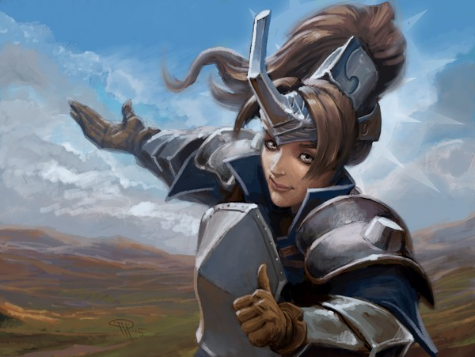
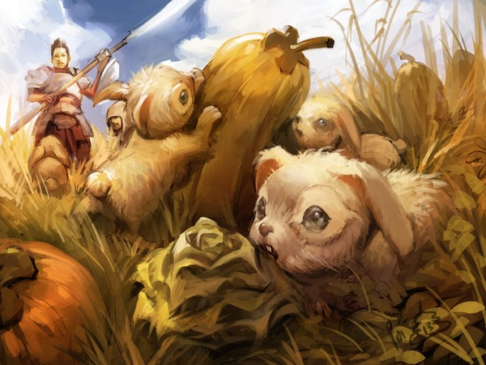

# The game is now free!

Posted on June 20 2018 by Måns Olson

Hello Scrolldiers,

It's time! We're releasing the game for free, for anyone to enjoy. The team's been working towards this behind the scenes for a long time now. I'm thrilled we're finally here! To those of you who've waited patiently for this, thanks. You're the best. <3

Ah, but hold on. We've got a new name - "Caller's Bane". I'm sure there's a good reason for it. Perhaps we just didn't like the sound of "Scrolls". Either way, it's still the same game you've known and loved.

## Download
To download the game, go to the [download page.](../README.md)

## Playing the game
The client needs to connect to a server. This is being released alongside the client - anyone can host their own server! The setup process for this is a bit tricky, but you could always play on somebody else's server. And to that end...

The wonderful kbasten, who runs Scrollsguide, has agreed to host a community server. It's already set up, and the client's prepared to connect to it straight away. It's just as easy to pick up & play as it's always been. Thanks Koen!

For those of you who want to host your own servers, the package contains instructions on how to set things up and some info on what you can do. Of note, you can re-balance the game entirely, change some of the rules, create new trials, and many other things, straight in the database. It's quite powerful!

## Community
We encourage everyone to join the Nognest discord server. There's a whole bunch of old players there, and it's a great place to discuss the game or anything around it: https://discord.gg/4pB2RtR

## That's all!
I'm looking forward to seeing you all in the game again. It'll be a blast (automaton)! Or maybe a blast (kinfolk). Who knows? It's up to you now.

See you on the battlefield!

Måns

PS. There's a few caveats. First, you'll all get the opportunity for a fresh start, as we can't bring everyone's collections of scrolls and decks over to community servers. But don't worry; server owners can decide to give everyone a full collection straight away, or change the gold and card distribution however they like. Second, there's no ingame friends list, as you won't be using the Mojang account system on community servers. Sorry!