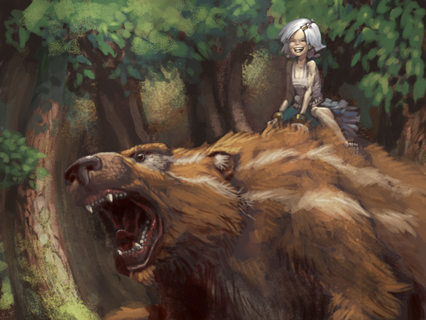
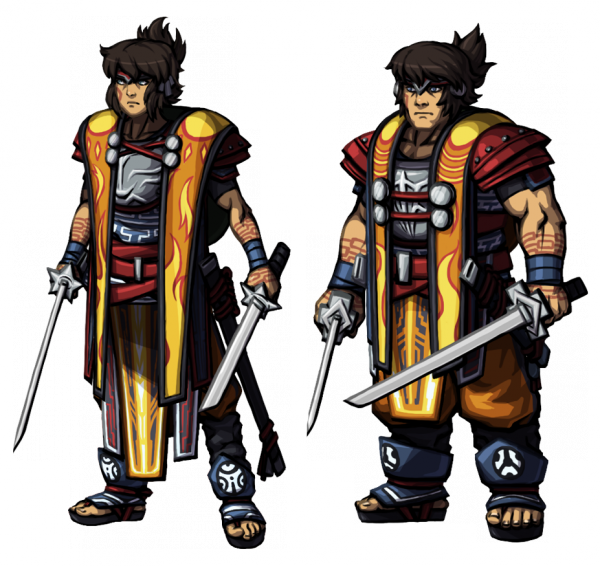
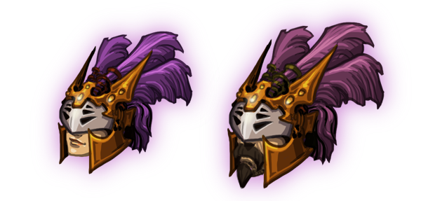
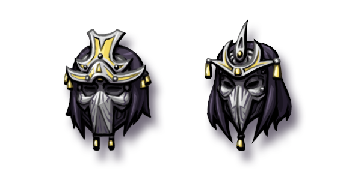
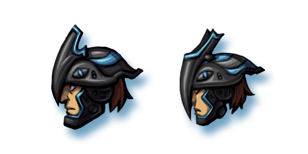

# This Week in Scrolls – Echoes is chambered

Posted on May 29 2015 by Gary

The release date for Echoes has been announced. Mount your favorite animal and come with me on a journey into the forest of upcoming Scrolls changes. It’s easy to get lost!

# Echoes imminence
First and foremost, if you haven’t seen the biggest news of the week: Click here first. Echoes, the seventh set in Scrolls, is set for release to the live servers June 9th along with all the new features currently on the test server. There were so many new features, in fact, that we had forgotten to add the new Judgement changes to that post when it went up yesterday. This has since been fixed, but it perhaps reflects the sheer volume of new changes and content headed its way to a Scrolls near you. Lots. Of. Stuff.

# Ranked rewards clarity
The new weekly ranked rewards and automated seasons were briefly touched on in the aforementioned post, but let’s go in to a bit more detail here.

There will be three separate automated Ranked reward systems.

## Weekly Top 50 rewards
Every week, you will have a chance to win parts of a complete avatar set based on your position on the ladder at the time it is calculated. This calculation will be the same time of the week on Sunday that you may already be familiar with for the Weekly Winner badge system.

What does this avatar set look like? Here it is, female and male, respectively:

How exactly is it distributed? Like this:

* 1st-10th place: Full set is awarded
* 11th-25th place: Head piece, Body piece, and Leg piece awarded
* 26th-50th place: Body piece and Leg piece awarded

In simple terms, this means that the Arms are the hardest to earn. We chose to make the Arms the most difficult to obtain because of large amount of unique heads players are already able to earn through other various means. After Echoes is released, if you see a player with sharp, long swords in his or her hands – Good luck.

Remember, you have a chance to win these each week. After earning them, you’ll receive a special private message informing you of your new threads.

## Automated ranked seasons
As mentioned in the post, automated seasons will last two months. At the end of those two months, the top 25 players will be awarded the purple feathered headpiece we are already familiar with. For those who are not, behold:

After each season, all player ratings will be “reset.” In more exact terms: all ratings will have an accelerated decay applied to it, which is how the previous ladder reset worked.

## Most ranked wins

This has already been in effect for a couple months now, but the weekly “Most Ranked Wins” avatar head will now be distributed automatically, as opposed to having it being manually rewarded. You won’t notice a difference, but we just wanted to remind everyone of its existence. In other words: Jon made my life a little easier. As a refresher, that avatar piece looks like this:

 
# Puzzle mode?
Jon and Aron have been furthering progress on custom match features. They’ve done so much, in fact, that a lot of it likely will have to wait until after Echoes is released. Sorry! Now, everything mentioned here is subject to change, but there are preliminary steps in place to set up a sort of “Puzzle mode” for custom matches. What will that mean exactly? Well, Puzzle matches would get a special icon next to their titles on the custom match list, and would operate in a particular manner, such as:

* The AI only Ends Turn (this is already possible as of the last test server patch)
* Your deck is not shuffled at the start
* Options for the creator to disable sacrificing for scrolls, resources, or both
Pretty cool, right? Players have always enjoyed solving “Spot the Win” puzzles they’ve made themselves for quite some time. This will maybe make that easier, and even become part of the game.

# New enchantment effects
The new enchantment effects are now on the test server, in all their sparkly glory. This is the first iteration of the enchantment effect changes, and there is a possibility it will be adjusted even further. Måns has already done the work of manually flagging each enchantment as either a “buff” or “debuff” with the thought that they might become specific colors in the future. A “neutral” color would be applied to a unit with both a buff and debuff enchantment applied to it. Once again, this is all preliminary and may or may not actually become reality.

# Balance patch incoming
We have a **_huge_** set of balance adjustments incoming, inspired from this community suggestion thread.

“Just how big, Atmaz?”

Well, as currently planned, over _forty_ scrolls are set to see some changes. Yes, over forty. We are aiming to get these on to the test server before Echoes goes live, but it may have to wait until shortly after.

In addition, we’ll continue to adjust the balance of the new Echoes scrolls and plan on tweaking them as necessary even after Echoes is released as players become more familiar (and therefore more dangerous) with the set.

# ESL Playoffs

It’s time! Seven weeks in the making, the top 8 players will compete for the championship of the Scrolls Open Cup Series 2015: Season Two. The top four will receive special tournament heads, and first place is set to receive 100€ courtesy of ESL Scrolls admin **DaOvalord**. It’ll all be streamed live with commentary on the official Scrolls twitch channel: twitch.tv/Scrolls. It’s set to kick off this Sunday, 31st of May at 18:00 CEST.

Good luck to the following players who have earned their place in this tournament. In alphabetical order:

* **Bronol**
* **ChiefBromden**
* **Demmiremmi**
* **Dialex**
* **futboleddy**
* **GiaLota**
* **NrpTheNinja**
* **PewQ**

See you this Sunday!

-Gary(@Atmaz)