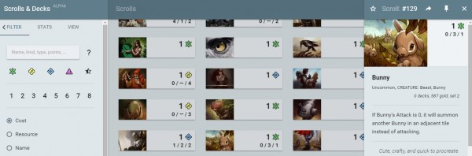

# This Week in Scrolls – Gotta test fast

Posted on May 22 2015 by Gary

Testers are knee deep in Echoes content at the moment, and we’re watching feedback closely. Here’s some of what you can expect to round itself out on the test server as we work to provide a patch for the general player population as soon as it’s ready.

# Echoes testing
If you missed the news, the complete set of Echoes content is now available on the test server for its final refinement before it jumps on to live servers. Play with it, break it, and push it as far as you can – then tell us how you feel about it!

Echoes contains many new powerful units and spells, and we’re watching things very closely. We will work on getting the set to an acceptable level before release, and afterward you can expect balance adjustments to continue as players become more experienced with the new scrolls.

You can also expect many adjustments forthcoming as a result of this suggestion thread. We’d like to thank everyone for their time in providing quality feedback.

# Custom match progress
New scrolls and balance adjustments aren’t all that Echoes will contain. Don’t forget about custom matches. We’re not completely finished fleshing out this new feature. Aron has mentioned a few new rules he’s thinking of adding support for, and a few we’re not prepared to reveal just yet. Expect more on this front next week.

# Replay hotkeys
Player feedback has been generally positive regarding the replay feature, but we’ve noticed a common complaint being the “control bar” that partly obscures the hands of the players. We agree this can be distracting, and have already locally implemented a hotkey to hide/show the replay controls. While Aron was at it, he also went and added hotkeys for every aspect of replay control. As it is currently implemented, F8 will toggle the display of the control bar, and F9-F12 will control the buttons therein.

# Community development – Scrolls and Decks

Community member **ensonador** has put together a really slick looking web application for sorting through the entire collection of Scrolls and filtering them through various means. While it’s still in its “alpha” phase, it’s definitely worth a look. He presents it with the disclaimer “Chrome browser only,” but users have reported it working just fine in multiple environments. Go ahead, give it a try!

# ESL Qualifier Tournament
Your last chance to make it into this season’s ESL playoffs is upon you. **DaOvalord** is collecting signups for this Sunday’s qualifier tournament, where you can occupy a spot if one of the 5th-20th placed players elects not to participate.

Congratulations are in order to those four who have already locked in their spots for the playoffs, which take place on May 31st:

* **ChiefBromden**
* **Bronol**
* **futboleddy**
* **alvarpq**
Well done!

Have a good weekend!… weekend… weekend…

-Gary(@Atmaz)

