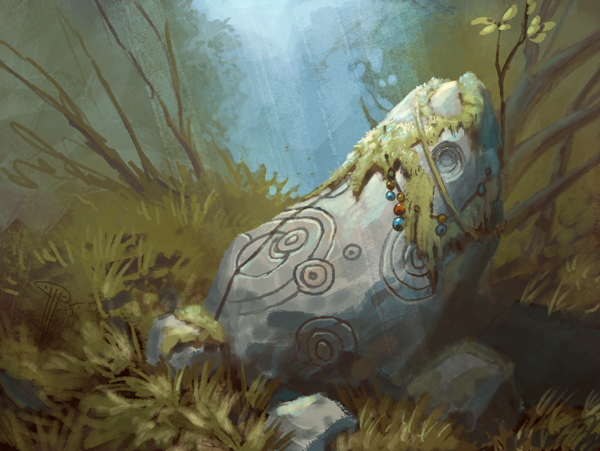
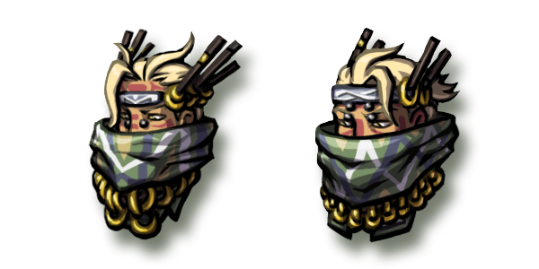
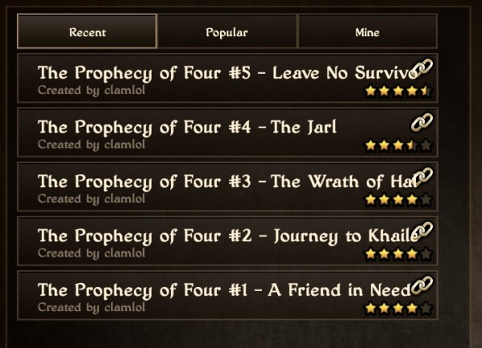
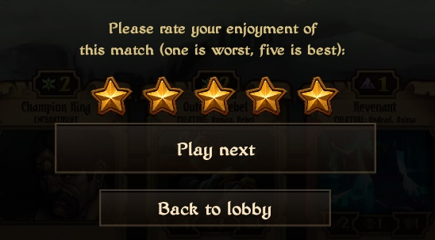
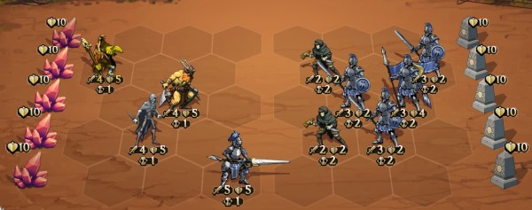

# This Week in Scrolls – Rocking Echoes

Posted on June 12 2015 by Gary

In case you’ve been living under a Menhir, Echoes was unleashed on to live servers earlier this week. The new ranked season has begun, and custom matches are sprouting everywhere. Read on for more!

# New Seasonal Heads
Everyone’s favorite purple-feathered friends are no more. The old seasonal heads are being retired, and the automated seasons are now set to distribute the new set of avatar heads to the Top 25 on August 2nd, the end of the current ladder season:

Speaking of new avatar parts, don’t forget that this Sunday is the first chance for everyone to earn the new “Weekly Ranked” avatar pieces. Secure your place in at least the Top 50 to earn some new threads.

# Post-Echoes known issues
Of course, with an update as large as Echoes, there are a few issues or bugs that we’re aware of and will be correcting.

## Replays
Currently, the Replay filter is only displaying a selection from the most recent 100 games in total. For example, if you choose to watch the most recent Ranked games, you may only see five or six on the list, even though you’re sure many more were played that day. This is because of the last 100 games total, only a few of those were ranked. We’ll need to work on a client patch to adjust this to display the last 100 games of the selected filter. This should give players a much larger history to choose from.

## Magma Thrower and Varas attack animations
Magma Thrower just doesn’t want to show off his fancy particle effects which are akin to the new Miasma Well attack animation. He’s expected to be reverted to Mattis’s hand-drawn animation with the next client patch.

In addition, one of Varas’s claws seems to break itself off and levitate in front of him for just a moment after he attacks. While we applaud him on this new technique he seems to have learned, we’re looking into correcting it.

## Scroll behavior issues
We’ve seen two major issues appear involving the new Echoes scrolls.

**Sleep Moratorium**: Currently, Sleep Moratorium is not taking Taxing into consideration. For example, if you use Sleep Moratorium to Sift out a 6 cost Damning Curse, you’ll only receive 4 Decay (the original cost). This is not working as intended, and will require a server patch to fix.

**Aes Moran Scholar and Corpse Theft**: This is a more serious bug which can leave a player unable to take an entire turn. We were unfortunately unable to provide a patch to remedy it this week, but it’s high on the priority list of necessary fixes.

# Custom Match spotlight
With the new Custom Match feature now on live servers, many creative players have been digging in and creating all kinds of interesting games. A popular scenario utilizes the “linking” option to create small campaigns or adventures that anyone can play.

Let’s walk through how you can play the five part adventure, “The Prophecy of Four”,  created by **clamlol**.

How to find it?
To start this adventure, you’ll need to click “Skirmish” on the Arena menu, then “Custom Match Rules.” At the bottom left you’ll find an area to enter search criteria. Try typing in “prophecy” and clicking “OK.” You should see something like this:

 

See that chain icon on the right side? That means each of these custom matches are “linked” to another custom match. In this case, they are linked sequentially. You’ll need to complete them in order starting with the first.

This particular adventure starts out easy and gets progressively more difficult. You’ll find yourself in control of a group of unlikely allies battling against the Empire. Your deck consists mostly of spells and enchantments, and you have access to limitless Wild. Don’t lose any of your important units, or you may just lose the match!

After completing one of the adventures, you can give it a star rating. You’ll notice a “Play Next” button in the same area. Click it to move on to the next adventure without needing to go back to the menu.

The final scenario in this adventure provides you with four units against an Imperial army.  Lose any one of them and they can’t be played on the board again. Be careful!

## Custom Match community tools
* **noHero** has recently created a Custom Game Maker mod for use with the Summoner mod.
* A web-based tool for creating custom matches comes from **Orangee** and **Hopefighter** and can still be found at Scrolldier.com.
 
# ESL Echoes Opening tournament
This Sunday, participate in the ESL Echoes Opening tournament for a chance to win some Echoes scrolls and gold. Should over 32 players participate, the top finisher will be the very first to receive the new tournament heads, shown here:

Losing track of the dates of upcoming Scrolls events? Scrolls subreddit moderator **Vulkenhyn** has worked hard recently at maintaining an Event Calendar of sorts on the sidebar of r/scrolls. Look for the schedule under “Upcoming Events.”

See you next week!

-Gary(@Atmaz)