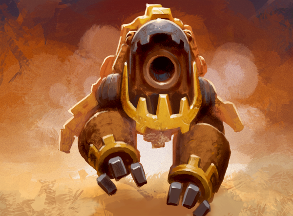

# This Week in Scrolls – Winding up to MINECON

Posted on June 26 2015 by Gary

MINECON is right around the corner, and we are gearing up to head to London next week. Read on for more details of what you can expect from us at MINECON, and don’t forget about the new test server patch.

# Test server patch
If you missed it, the latest set of changes and features has hit the test server today. Don’t worry, Beetle Stone enthusiasts, we hear your cries of horror.

A nice addition you may have missed is that a convenient “Play Again” button is being added to custom skirmishes, meaning you can continue to try those tough “Spot The Wins” that have become popular without having to find them again in the menu. Like this one, that one, and this one!

 

# MINECON Open update

We have pretty much finalized our tournament setup for the MINECON Open Finals, and it’s looking good.

The entire Scrolls team will be attending MINECON, including myself and Gareth. We will be sharing a live “tournament stage” where other fun Minecraft events will be taking place. While we won’t be able to broadcast every single match of the finals on that stage, as time slots are limited, we will be breaking the tournament up over two days in order to cover as much as possible. **Blinky** has volunteered to help out with the commentary, and you’ll find us at a desk near the Scrolls area when we’re not on stage.

## The MINECON Schedule
MINECON is taking place in London, England – therefore all times will first be introduced in BST (British Summer Time) and then GMT (Greenwich Mean Time).

### Saturday, July 4th:
11:00 BST (10:00 GMT)

The Finals shall begin at this time. All matches will proceed sequentially until the final two “Best of 3” matches are ready, at which point the tournament shall be put on hold until we take our place on our live tournament stage area.

17:00-19:00 BST ( 16:00 – 18:00 GMT)

The last two “Best of 3’s” will begin, and shall be broadcast live at MINECON in a two hour time slot on the live tournament stage. Once these matches are over, the tournament continues the following day with the final two players.

### Sunday, July 5th:
15:00-17:00 BST (14:00 – 16:00 GMT)

The “Best of 5” grand final match will begin, and shall be broadcast live on the tournament stage.

 

# Community spotlight
As we continue our efforts to recognize those who better the Scrolls community, there’s a player who has put in a lot of work in the Scrolls modding community, and probably deserves much more than a simple avatar head, but nonetheless:

* **noHero**: If you aren’t already familiar with his Summoner mod repository, you might want to take a look. It’s filled with interesting modifications, not the least of which is his newest “Custom Match” maker, which can help you visualize your creations more easily. Thank you, **noHero**!
 

# Tournaments
We’ve got a weekend full of tournaments. Take your pick!

## MrGrumpyTurtle Challenge – Friday, June 26th – 18:00 GMT
Regular Scrolls streamer **MrGrumpyTurtle** will be hosting a tournament today very soon after this post! You can still participate. Find more information here.

## Echoes Battle Tournament – Saturday, June 27th – 15:30 GMT
**Teteduo** is organizing a special tournament this Saturday. It will use the Swiss system – a format where you accumulate points by winning matches and are matched up against opponents who are, in theory, closer to your skill level. Why not give it a try? There’s plenty of gold and Scrolls going around. Find more info here.

## MINECON Open Qualifier #2 – Sunday, June 28th – 16:00 GMT
This will be your last chance to earn a spot in the MINECON Open. The top four finishers will join the previous finalists in the final brackets for MINECON.

Register here
Sign-ups close at 22:00 GMT on Saturday.

Have a good weekend!

-Gary (@Atmaz)